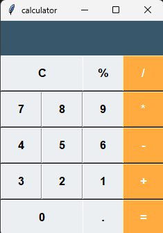

# Calculator - Tkinter

## 🇩🇪 Beschreibung (Deutsch) | 🇬🇧 Description (English)
Diese einfache Taschenrechner-App wurde mit Python und Tkinter entwickelt. Sie unterstützt grundlegende mathematische Operationen und bietet eine benutzerfreundliche Oberfläche.

This simple calculator app is built using Python and Tkinter. It supports basic mathematical operations and provides a user-friendly interface.

---

## 🔧 Funktionen | Features
- Addition, Subtraktion, Multiplikation und Division
- Klare Anzeige des eingegebenen Werts
- Einfache Benutzeroberfläche mit stilvollen Schaltflächen
- Reset-Button zum Löschen der Eingabe

- Addition, subtraction, multiplication, and division
- Clear display of entered values
- Simple user interface with stylish buttons
- Reset button to clear the input

---

## 🖥️ Screenshot


---

## ⚙️ Installation & Ausführung | Installation & Execution

### 💻 Voraussetzungen | Requirements
- Python 3.x

### 🔄 Installation
Klonen Sie dieses Repository und führen Sie das Skript aus:

Clone this repository and run the script:

```bash
# Repository klonen | Clone the repository
git clone https://github.com/LeonardoMeyer/simple-calculator.git
cd simple-calculator

# Skript ausführen | Run the script
python calculator.py
```

---

## 🌟 Verbesserungen | Future Improvements
- Hinzufügen einer wissenschaftlichen Taschenrechnerfunktion
- Anpassbare Themen und Farben
- Mobile Version mit Kivy

- Adding a scientific calculator function
- Customizable themes and colors
- Mobile version using Kivy

---

## 👥 Autor | Author
[Leonardo meyer] - GitHub: [Leonardomeyer]


